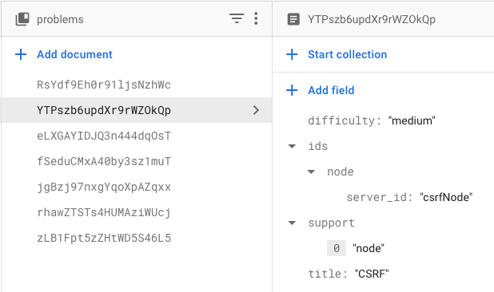

# Sandboxes

This repository contains the different sandboxes that we're using as part of VITAL. It was historically used for POCs, but was converted to be a repo for the sandboxes as most of the POCs were sandbox related.

## How to add a new sandbox?

All sandboxes are docker based. Create a folder to put your sandbox in, create a `Dockerfile` which creates your sandbox container and push. See various existing examples.

Note that nothing is "automatic" as of yet. Adding a sandbox here doesn't mean it's available on the VITAL platform directly. There are a few manual steps, which we've not had the time to automate.

### How to write a tutorial?

We will follow our "Explore-Exploit-Mitigate" way of learning. Place the content in a markdown file, that should look like this

```markdown
---
server_id: <the server id available in the prod_env.js>
language: node|python|...
---

<!-- explore-start -->

Put the content for the "Explore" section

<!-- explore-end -->
<!-- exploit-start -->

Put the content for the "Exploit" section

<!-- exploit-end -->
<!-- mitigate-start -->

Put the content for the "Mitigate" section

<!-- mitigate-end -->
```

`server_id` is the way the node backend, firebase, and UI identify a particular problem and its sandbox. The comments `<!-- xxx-start/xxx-end -->` **are case sensitive** are used to split the markdown file into the different areas.

### How to correctly update to Firebase?

First, update the `/problems` collection

#### Adding a new completely new problem?

1. "Add document" under `/problems`. Let the ID be Auto ID.
1. Add `difficulty`, `title` as strings and `support` as an array.
1. Follow the next section to add the details of the ids and support.

#### Adding a new language support for a problem that's already there?

1. Find the problem under `/problems`.
1. Under `/ids`, create a new map with name as your language.
1. Add a key called `server_id` inside that map, and its value as the `server_id` that you've decided.
1. Add your language in the `support` array as well.

Example of how a new problem should look



Now, update the `/problem_contents`

1. Create an `.env` file inside `content-generator` folder. Add a key `GOOGLE_APPLICATION_CREDENTIALS`, and value as the path to the JSON file that you can use to get admin access. For the file, look in Project settings > Service accounts > Generate new private key. FYI, you'll need to do this only once.
1. Add the path of markdown file you just wrote, relative the root of the repo, [here](content-generator/index.js#L23).
1. Run `node index.js` inside `content-generator` folder. You will have to run `npm install` to get the dependencies of the project once as well.

## Notes

1. The content-generator is not intelligent at all. It just blindly updates all the files.
1. There is bare minimum error handling. So make sure you follow the instructions correctly. If something is too obvious or annoying, go ahead and raise a PR.
1. The goal of this project is to simplify pushing the markdown content to firebase and it does just that for now. No extra validations, no extra bells and whistles.
