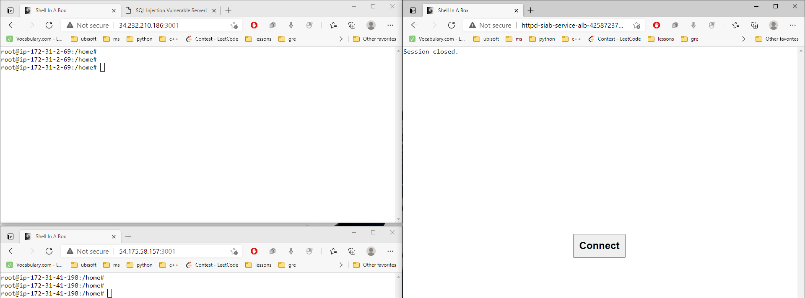

- **Capture the flag: 2021 CTF Hacking**: 
    - [x] What is Capture the Flag in Security?
        - [x] see AT&T Cybersecurity
        - [x] see [Google CTF](https://capturetheflag.withgoogle.com/)
    - [x] how it’s done exactly to leverage in the project.
        - [x] creates sandboxes for hacking and gives access to only required endpoints.
    - [x] research sources
        - https://www.youtube.com/watch?v=8ev9ZX9J45A
        - they are challenges. which one can do learn via challenge but they are not meant as for learning, it for hacking.
        - takes weekend not that time.

- figure how to create docker and provide web based UI for it.
    - play-with-docker uses [xterm](https://github.com/xtermjs/xterm.js)
        - verified by inspect element and the left panel is x-term
        - and looked at [source code](https://github.com/play-with-docker/play-with-docker/tree/3a762ba15cf8e44908f590959e758643e796afa2/handlers/www/assets)
        - search for new Terminal [here](https://github.com/play-with-docker/play-with-docker/blob/3a762ba15cf8e44908f590959e758643e796afa2/handlers/www/assets/app.js#L462) and click for reference it goes to [xterm](https://github.com/play-with-docker/play-with-docker/blob/3a762ba15cf8e44908f590959e758643e796afa2/handlers/www/assets/xterm/xterm.js#L4123)

- what if we just give web interface terminal for AWS?
    - can't be done need to set the IAM roles and aws creds which is not possible for web interface/app.

---


- [x] **web terminal**:
    - [xterm](https://xtermjs.org/): is not the whole end to end solutions. its just UI.
    - [webssh2](https://github.com/billchurch/WebSSH2): did not work as expected, has node.js dependencies hence rejected.
    - [wetty](https://github.com/butlerx/wetty):
        - successfully worked on local machine, with dockers exec as well.
        - successfully worked on AWS ec2 instances, with dockers exec as well.
        - had issues running with auto login.
        - will need active maintaining as it is not as robust.
    - [shellinabox](https://github.com/shellinabox/shellinabox)
: **winner**
        - readily available as nix package.
        - no management and very robust
        - works with docker and with autologin.
        - working as a docker container.
        - working as embedded layer in other docker containers.

---
winner -> shellinabox setup and installation.
    - [shellinabox](https://www.tecmint.com/shell-in-a-box-a-web-based-ssh-terminal-to-access-remote-linux-servers/)
    ```
    sudo apt-get update
    sudo apt-cache search shellinabox
    sudo apt-get install openssl shellinabox
    ```
    - [via docker](https://brunodelb.medium.com/access-via-web-ssh-inside-a-docker-container-62e8a9418e76)
```
sudo docker container run --rm \
--name shellinabox \
-p 3002:3002 \
-e SIAB_USER=test \
-e SIAB_PASSWORD=test \
-e SIAB_SUDO=true \
-e SHELLINABOX_PORT=3002 \
-e SIAB_PORT=3002 \
-v $PWD/dev:/usr/src/dev \
sspreitzer/shellinabox:latest
```


- **shellina box setup with different AWS based solutions.**

- approach 1: using ECS with EC2 linux with custom AMI with the following configs.
    - on startup the instance will star with this command already.
        ```
        sudo shellinaboxd -b -t -p 3001 -s /:ubuntu:ubuntu:/home/ubuntu:"docker exec -it vulnerable-server /bin/bash" 
        ```
    - [ ] to add to start we will add via [startup jobs](https://smallbusiness.chron.com/run-command-startup-linux-27796.html) or [user data](https://docs.aws.amazon.com/AWSEC2/latest/UserGuide/user-data.html) can be used to install packages.. here the shellinabox. NOTE: reboot does not rerun the user agent script.

    - every entry docker will have name convention, for examples.
        ```
        docker run -dit --name vulnerable-server -p 8080:80 -v "$PWD":/usr/local/apache2/htdocs/ httpd:2.4
        ```
    - progress: 
        - done and tested the POC on AWS instances succesfully.


- approach 2: using AWS fargate 
    - using fargate have benefits of no instance management, more efficient instance use and lower cost.
    - we can just focus on creating vulnerable  docker as sandbox.
    - each docker sandbox can spawn new ECS task (via elb or some event).
    - each docker sandbox will have shellinabox preinstalled and running.
    - progress:
        - [x] implemented and tested the custom httpd server with sheelinabox docker with fargate succesfully. to try checkout the containerWithSIAB folder.
        - [x] pushed the image to ECR too.
            - [x] had to install AWS cli 2 after uninstalling AWS cli 1.
            - [x] configure IAM admin role and run `aws configure` to set new AcceessID and password.
    - issues: 
        - with target group and Application load balancers the httpd shellinabox is not working  

- [x] deploy sql injection:
    - [x] test with SIAB running on 3001 inside container. 
    - [x] deployed on aws by pushing the docker images with SIAB with tag sql_inj and spawned through /sandbox/spawn, took 42 seconds.

- [x] VITAL backend node.
    - [x] add routes to serve pages and requests.

- [ ] set up basic SQL injection attack in node
- [ ] prevent user from doing rm -rf
    - [ ] restrict to only edit the file.
- [ ] make the flask server not exit the container on errors like indentation error etc see vim fix error.

- [x] do we need normalize port?
    - [x] not needed if port from config. https://stackoverflow.com/questions/55988881/what-does-normalizeport-function-do-in-nodejs#:~:text=The%20normalizePort(val)%20function%20simply,number%2C%20string%2C%20or%20false.

- [x] create constants and .env file and config files and error contants file.
    - [x] https://codingsans.com/blog/node-config-best-practices 
    - [x] .env files contains things which we don't commit to github as they might have credentials.
    - [x] config file for ports etc.
    - [x] created helpers.
    - [x] created errors as well.

- [x] check node express backend best practices.
    - [x] reference express generator and error handling and validation articles.
- [x] remove deprecated node express bodyparses etc.
- [x] restructre to keep all backend code in one folder.
- [x] restructure to support default express builder format.
- [x] CORS use build in.
- [x] set js linter
- [x] a data validator like validator.js for data and convict for configs.
- [ ] dicuss persistant storge for container cleanups.
    - [ ] explore firebase
- [x] [error handler](https://sematext.com/blog/node-js-error-handling/)
    - [x] https://expressjs.com/en/guide/error-handling.html
    - [x] https://jasonwatmore.com/post/2020/05/13/node-mongo-api-with-email-sign-up-verification-authentication-forgot-password#error-handler-js
    - [x] https://codeburst.io/better-error-handling-in-express-js-b118fc29e9c7
    - [x] https://sematext.com/blog/node-js-error-handling/
    - [x] https://blog.heroku.com/best-practices-nodejs-errors

- [ ] [revise js](https://javascript.info/)
    - [ ] scopes let const etc.
    - [ ] revisit js interview questions.

- [ ] deploy vital
